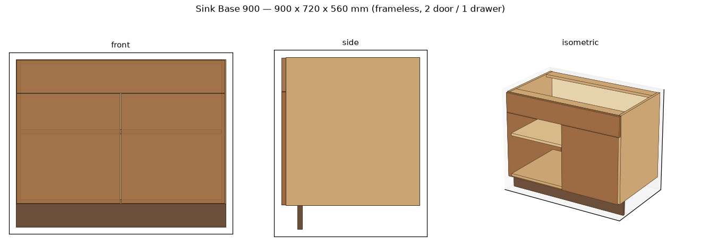

# Woodworking AI

[](https://github.com/adauzat90/woodworking_ai/actions/workflows/ci.yml)

Design cabinets and furniture with **AI agents that write a parametric design
language**, then compile that language into real, machinable 3D geometry, cut
lists, and hardware schedules.

This follows the pattern proven by [Zoo's **Zookeeper**](https://zoo.dev/research/zookeeper)
agent: the AI does not draw the furniture — it writes *code* in a parametric
language, runs it to build real geometry, checks the result, and repairs its own
code until the design is buildable. See [`docs/ARCHITECTURE.md`](docs/ARCHITECTURE.md)
for the full design, prior-art comparison, and engine rationale.

```
Natural language ─▶ Designer agent (Claude) ─▶ DSL spec ─▶ Validator
                                                   │            │ valid
                         repair ◀─────────────────┤            ▼
                                                   │      Compiler (build123d)
                                                   │            │
                                                   └─ Critic ◀──┘  measure &
                                                      verify        check
                                                        │ pass
                                                        ▼
                          STEP · STL · GLB · cut list · hardware
```

The **Critic** closes the loop: it rebuilds the geometry, measures it, and
checks the overall envelope, part interferences, and front coverage against the
spec — feeding any problem back to the Designer for repair (it caught a real
rail-vs-back collision during development). It runs analytically with no CAD
dependency. It can also do a **render-based review**: snapshot the model and ask
a vision-capable Claude to flag anything measurement misses.



*Front / side / isometric snapshots rendered headlessly from the spec — the same
images the render-based Critic hands to the vision model.*

## Why this approach

LLMs are far better at producing and debugging *language* than binary geometry.
So the source of truth is a small, typed **furniture DSL** (see
[`dsl.py`](src/woodworking_ai/dsl.py)) — a JSON spec the agent writes, that is
deterministically validated and compiled. The agent only has to get the *spec*
right; the compiler handles the geometry, and the same spec produces the cut
list and hardware list, so there is a single source of truth.

## Install

```bash
pip install -e .            # core: DSL, validator, cut list (no heavy deps)
pip install -e ".[agent]"   # + the Claude designer agent
pip install -e ".[cad]"     # + build123d for 3D geometry / STEP / STL / GLB
pip install -e ".[render]"  # + matplotlib for snapshot renders / visual review
pip install -e ".[all]"     # everything, incl. pytest
```

The DSL, validator, and cut list have **zero CAD dependencies** and run anywhere.
`build123d` (OpenCascade) is only needed to build and export 3D geometry.

## Quickstart

**Build straight from a spec — no API key, no CAD needed:**

```bash
python examples/base_cabinet.py
```

**Natural language → design (needs `ANTHROPIC_API_KEY`):**

```bash
export ANTHROPIC_API_KEY=sk-...
woodai design "36 inch sink base, two shaker doors, soft-close, one shelf"
```

**Also export 3D geometry (needs build123d):**

```bash
woodai design "tall pantry 600 wide, 4 shelves" --out ./out --step --stl
woodai build out/spec.json --out ./out --step   # rebuild from a saved spec
```

**Render snapshots and a visual review (needs matplotlib; review needs a key):**

```bash
woodai build out/spec.json --out ./out --render          # PNG snapshots
woodai design "30 inch drawer base, 3 drawers" --out ./out --visual-review
```

**Cost estimate, drilling schedule, and DXF cut-layout:**

```bash
woodai build out/spec.json --estimate --drill
woodai build out/spec.json --out ./out --dxf       # writes cutlayout.dxf
```

**Imperial, in and out** (for US shops): add `--imperial` to render the cut list
and reports in fractional inches (to 1/16″). The engine stays millimetre-native
— only the display changes; the 32 mm drilling schedule remains in mm because it
*is* a metric boring system. You can also *author* in inches: set
`"units": "in"` in a spec (or use inches in the web form) and dimensions are
converted to mm on load. The web UI has a single units toggle for both.

```bash
woodai build out/spec.json --estimate --imperial
```

**Projects (multi-cabinet runs):** a spec with `"kind": "project"` holds several
placed components (a kitchen run, a built-in). The whole pipeline aggregates
across the run — one combined cut list (parts tagged per cabinet), one quote, a
placement-overlap check, and a **single assembled 3D model**: the Critic checks
the placed cabinets don't collide, `--step/--stl/--glb` export the whole run as
one file, and `--dxf` nests every part into one cut-layout.

```bash
woodai build my_kitchen.json --estimate --imperial          # combined cut list + quote
woodai build my_kitchen.json --out ./run --glb --dxf        # assembled GLB + nest
```

**L- and U-shaped runs:** components are placed by a front-left-corner anchor and
a wall angle, and overlaps are checked with oriented 2D footprints (so the inner
corner where two perpendicular runs meet is verified, not just a straight row).
The `place_run` helper lays a run along a wall so you don't hand-compute
rotations:

```python
from woodworking_ai import CabinetSpec, Project, place_run

run_a = place_run([CabinetSpec(width=600), CabinetSpec(width=600)], start=(0, 0),    angle=0)
run_b = place_run([CabinetSpec(width=600), CabinetSpec(width=600)], start=(1200, 560), angle=90)
kitchen = Project(name="L-kitchen", components=run_a + run_b)   # validate / cut list / GLB
```

**Everything at once:**

```bash
woodai build out/spec.json --out ./out --step --stl --glb --dxf --drill --estimate
```

Pick the model with `WOODAI_MODEL` (default `claude-opus-4-8`; e.g.
`claude-sonnet-4-6` for cheaper runs).

## Web app

A FastAPI backend serves a single-page designer with a live 3D preview:

```bash
pip install -e ".[web,cad,render]"
python -m woodworking_ai.web          # http://127.0.0.1:8000
```

Type a description (uses Claude if `ANTHROPIC_API_KEY` is set) **or** dial in the
parameters, and get an interactive GLB model (via `<model-viewer>`), the cut
list, hardware schedule, cost estimate, and drilling schedule — all in the
browser. Plus:

- **Live update** — toggle on to rebuild as you change parameters.
- **Downloads** — STEP, STL, GLB, DXF cut-layout, cut-list & drilling CSV.
- **Share links** — encodes the design in the URL; open it to restore the design.
- **Library** — save/load named designs. Uses **Convex** when configured
  (`CONVEX_URL`), otherwise the browser's `localStorage`. See [`convex/`](convex/).

The API:

| Endpoint | Purpose |
|---|---|
| `POST /api/build` | spec → full bundle (cut list, cost, drilling, render PNG, GLB) |
| `POST /api/design` | natural language → spec → bundle (needs an API key) |
| `GET /api/health` | capability flags (render / glb / llm) |

It degrades gracefully: without `build123d` it falls back to the matplotlib
render image; without an API key the AI box is disabled but parametric build
still works. The 3D/cost/drilling logic lives in `service.py`, shared by any
front end.

> **Deploying:** the frontend is static and host-anywhere, but the geometry
> backend needs a Python host that can run `build123d` (OpenCascade) — a
> container or VM, not a size-limited serverless function. Run `service.py`
> without `build123d` for a lighter render-only deployment.

## What it can model

- **Cabinet types:** `base` (toe kick + open top), `wall` (hung, enclosed top,
  no toe kick), `tall` (pantry, floor-to-ceiling), `corner_blind` (offset
  opening + filler), `corner_diagonal` (angled door), `bookcase` (open
  shelving), `dresser` (drawer bank).
- **Tables:** a `table` furniture type — top, four legs, and aprons, with the
  same critique / cut list / cost / render / STEP-export pipeline.
- **Construction:** `frameless` (Euro, overlay doors) and `face_frame`
  (hardwood stiles/rails + inset doors).
- **Fronts:** any mix of doors (0–2), a center mullion, and a stack of drawers
  (with real drawer **boxes**, or false fronts for sink tip-outs), plus
  configurable reveal, back style, joinery, shelves, and toe kick.
- **Outputs:** validated spec, geometry critique, headless render + optional
  visual review, cut list + hardware schedule (CSV), a **drilling schedule**
  (32 mm system shelf pins, hinge bores, slide lines), a sheet-nesting **cost
  estimate**, a **DXF cut-layout**, and STEP/STL/GLB when build123d is installed.

## The design language (example)

```json
{
  "cabinet_type": "base",
  "name": "Sink Base",
  "width": 900, "height": 720, "depth": 560,
  "material": { "carcass": 18, "back": 6, "door": 18, "shelf": 18 },
  "construction": "frameless",
  "back": "rabbeted",
  "joinery": "dado",
  "toe_kick": { "height": 100, "setback": 50 },
  "shelves": 1, "doors": 2,
  "drawers": [ { "front_height": 140 } ],
  "reveal": 3, "edge_banding": true
}
```

## Project layout

| Path | What |
|---|---|
| `src/woodworking_ai/dsl.py` | The furniture language (typed spec + JSON) |
| `src/woodworking_ai/validator.py` | Type/range + woodworking sanity rules |
| `src/woodworking_ai/cutlist.py` | Spec → parts + hardware (pure math) |
| `src/woodworking_ai/geometry.py` | `panel_layout()` — single source of panel placement |
| `src/woodworking_ai/builder.py` | Spec → build123d B-Rep geometry |
| `src/woodworking_ai/render.py` | Headless front/side/iso snapshots (matplotlib) |
| `src/woodworking_ai/estimator.py` | Sheet nesting + cost estimate (pure math) |
| `src/woodworking_ai/drilling.py` | 32 mm drilling schedule: pins, hinges, slides |
| `src/woodworking_ai/dxf.py` | DXF cut-layout nest diagram (pure text) |
| `src/woodworking_ai/exporters.py` | STEP / STL / GLB / DXF / CSV export |
| `src/woodworking_ai/agents/designer.py` | Claude designer + validate/critic-repair loop |
| `src/woodworking_ai/agents/critic.py` | Computational + render-based (visual) verification |
| `examples/base_cabinet.py` | End-to-end example, no LLM required |
| `tests/` | Pure-math tests (no CAD / API key needed) |

## Run the tests

```bash
pip install -e ".[dev]"
pytest
```

## Status & roadmap

MVP: frameless **base cabinets** end to end, including the **Critic** verify
loop with both computational and render-based (visual) review. Next: wall/tall
cabinets, face-frame construction, sheet nesting + cost, and a web UI with live
GLB preview. Full roadmap in [`docs/ARCHITECTURE.md`](docs/ARCHITECTURE.md).
