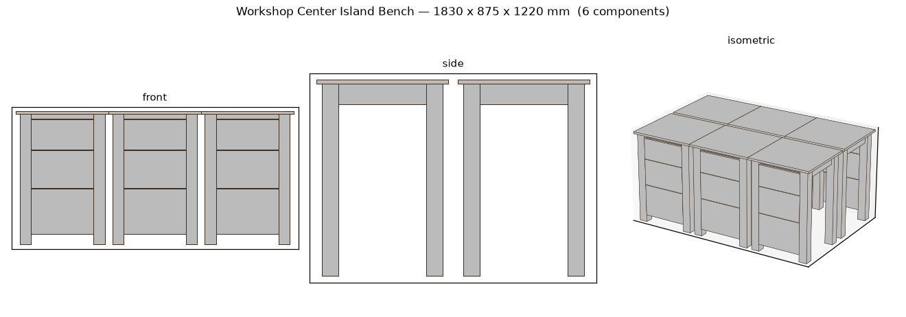
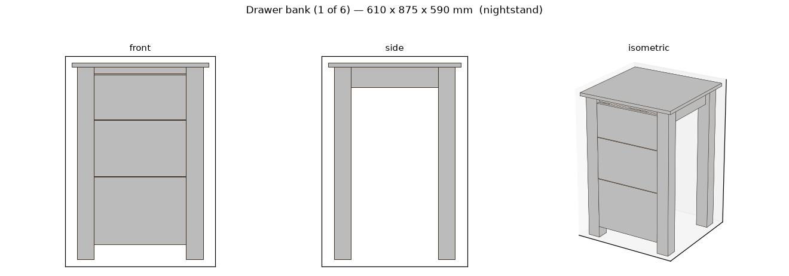

# Workshop Center Island Bench

A heavy, double-sided drawer island for the middle of a workshop — work from any
side, store a shop's worth of tools in **18 slide-free drawers**.



## At a glance

| | |
|---|---|
| **Footprint** | 1830 × 1220 mm (72″ × 48″ = **6 × 4 ft**) |
| **Work-surface height** | 915 mm (**36″ = 3 ft**) |
| **Drawers** | **18** total — six banks of three graduated drawers, opening on **both** long sides |
| **Drawer motion** | **No metal slides** — traditional side-hung **wooden runners** |
| **Primary wood** | Hard maple (tough, heavy, holds a wooden runner well) |
| **Joinery** | Mortise-and-tenon frames, hand/jig **dovetailed** drawer boxes |
| **Est. cost (solid maple)** | ≈ **$3,030** (banks ≈ $2,530 + benchtop ≈ $500) |
| **Est. shop time** | ≈ 120 h banks + ~15 h benchtop (advanced) |

## Why this layout

A center island earns its floor space by being reachable from all four sides, so
the storage is split into **two back-to-back rows of three drawer banks**. You
get drawers on both 6-ft faces and can stand and work at any edge. Each bank is a
self-contained maple pedestal; the six bolt together and to the benchtop into one
rigid mass — a center table you can plane against without it walking across the
floor.

```
 PLAN (looking down)          1830 mm (6 ft)
      ┌───────┬───────┬───────┐
      │ Front │ Front │ Front │  ← 3 banks, drawers open this way
  1220│   L   │   C   │   R   │
  mm  ├───────┼───────┼───────┤  ← ~40 mm center spine
 (4ft)│ Back  │ Back  │ Back  │  ← 3 banks, drawers open the other way
      │   L   │   C   │   R   │
      └───────┴───────┴───────┘
     Each bank: 610 W × 590 D × 875 H, 3 graduated drawers
```

## The drawer system — no slides

Every drawer rides on **wooden runners**, the way case furniture was built for
centuries — nothing to buy, nothing to wear out, and dead simple to repair.

- Each drawer **side is ploughed with a groove** (12 × 6 mm) that rides a
  **maple runner strip** fixed to the bank frame (2 runners per drawer).
- Drawer boxes are **dovetailed** (tails on the sides so a front can never pull
  off) with a 6 mm plywood bottom in a groove.
- Fronts **graduate 200 / 250 / 300 mm** top-to-bottom — shallow drawers up top
  for hand tools and hardware, deep ones at the bottom for power tools.
- **Zero holes to drill** for hardware, and the only metal in the whole piece is
  the drawer pulls. (The tool's own drilling schedule confirms: *0 holes.*)

Wax the runners and grooves and the drawers glide. Because maple sides on maple
runners wear slowly and are easily re-waxed or re-planed, this outlasts any
ball-bearing slide.

## Structure & joinery

- **Legs:** 75 mm square hard-maple posts, four per bank.
- **Frames:** aprons and rails join the legs with **mortise-and-tenon** (7 × 45
  mm tenons) — the joint that resists the racking that kills legged furniture.
- **Assembly:** banks are screwed to each other along their touching faces and
  lag-screwed up into the benchtop, so the island behaves as one heavy unit.
- **Benchtop:** a **40 mm edge-grain laminated hard-maple slab**, 1830 × 1220 mm
  (~32 strips of 38 mm stock). It is fastened down with **figure-8 / Z-clips** so
  the solid top can expand and contract across its width without cracking.

## Materials & wood movement

Everything shown is **hard maple** — the right wood for a bench (hard, tough,
heavy) and specifically for wooden runners, which need a dense, stable species.
Two deliberate movement decisions:

- The **benchtop floats** on figure-8 fasteners — never rigidly screwed across
  its width.
- Drawer **bottoms are 6 mm plywood** (dimensionally stable) in a groove.

**Cost / weight option:** an all-maple island is an heirloom (and heavy, which is
a *feature* for a center table). To cut roughly a third of the cost and a lot of
weight, build the **carcasses and drawer boxes from Baltic-birch plywood** and
keep solid maple only for the legs, runners, drawer fronts, and benchtop. Wooden
runners still work — just glue a solid-maple wear strip where the ply drawer side
rides.

## Per-bank cut list (×6 banks)

| Qty | L × W × T (mm) | Part |
|---:|---|---|
| 1 | 610 × 590 × 18 | Sub-top / mounting deck |
| 4 | 857 × 75 × 75 | Leg |
| 2 | 390 × 90 × 22 | Apron, side |
| 1 | 410 × 90 × 22 | Apron, back |
| 1 | 410 × 30 × 22 | Front rail (above top drawer) |
| 1 | 410 × 200 × 18 | Drawer front 1 (top) |
| 1 | 410 × 250 × 18 | Drawer front 2 |
| 1 | 410 × 300 × 18 | Drawer front 3 (bottom) |
| 6 | 525 × 160–260 × 12 | Drawer sides (dovetailed, grooved) |
| 6 | 361 × 160–260 × 12 | Drawer ends |
| 3 | 361 × 513 × 6 | Drawer bottoms (plywood) |
| 6 | 525 × 18 × 12 | **Wooden runners** |

Benchtop (built once): **32 × 1855 × 38 × 40 mm** maple strips, edge-glued to a
1830 × 1220 × 40 slab.

Full machine-readable lists: [`cutlist_one_bank.csv`](cutlist_one_bank.csv),
[`cutlist_banks.csv`](cutlist_banks.csv) (all six),
[`cutlist_benchtop.csv`](cutlist_benchtop.csv).

## Hardware

- **18 × bar pulls** (one per drawer) — the *only* purchased hardware.
- **36 × figure-8 / Z-clip** tabletop fasteners (benchtop attachment).
- **No drawer slides. No slide screws. No hinges.**

## A single drawer bank



## Rebuild / verify it yourself

The design is a parametric spec. From the repo root:

```bash
woodai build designs/workshop_center_island/workshop_island.json --estimate --joinery
woodai build designs/workshop_center_island/benchtop.json --estimate
```

Both validate with **0 errors and 0 part interferences**. Edit the JSON (drawer
graduation, wood species, bank size) and rebuild to explore variations.

### Note on the model

The island is expressed as six drawer-bank modules (the DSL's `nightstand` type
with `slide_type: "wood"`, which is the only drawer primitive that models
slide-free wooden runners). The 40 mm benchtop that caps and unifies them is a
separate glue-up (`benchtop.json`) — in the tool a single top can't span across
independent modules, so it's specified and costed on its own. Physically it's one
slab lagged down over all six banks.
